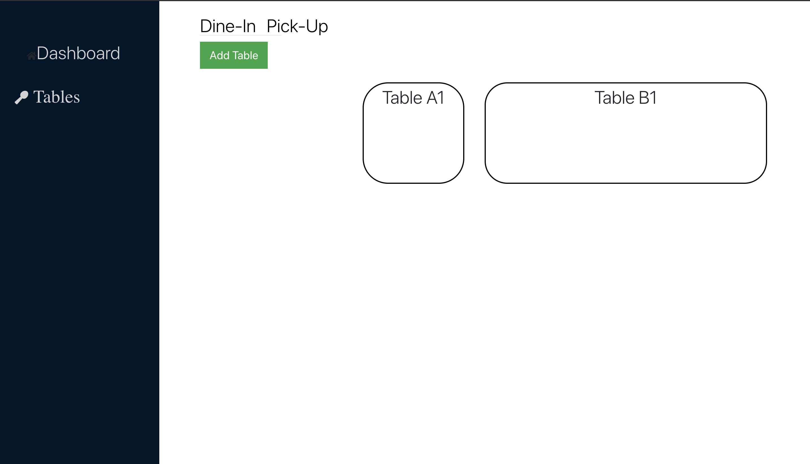
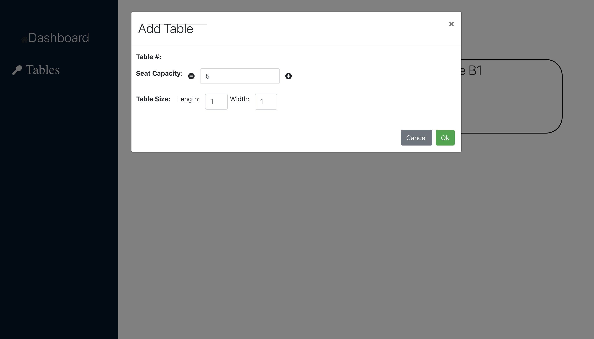
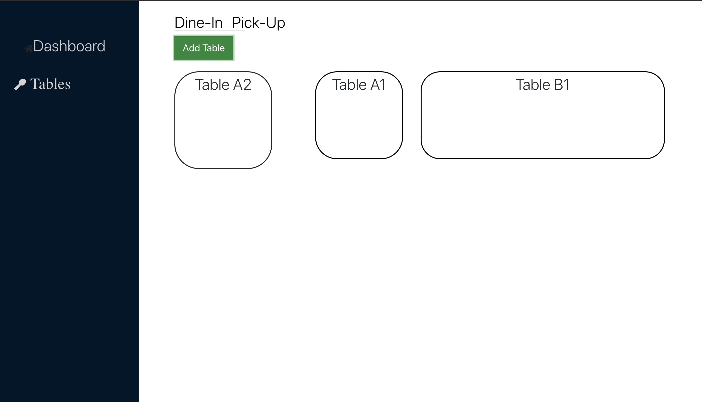
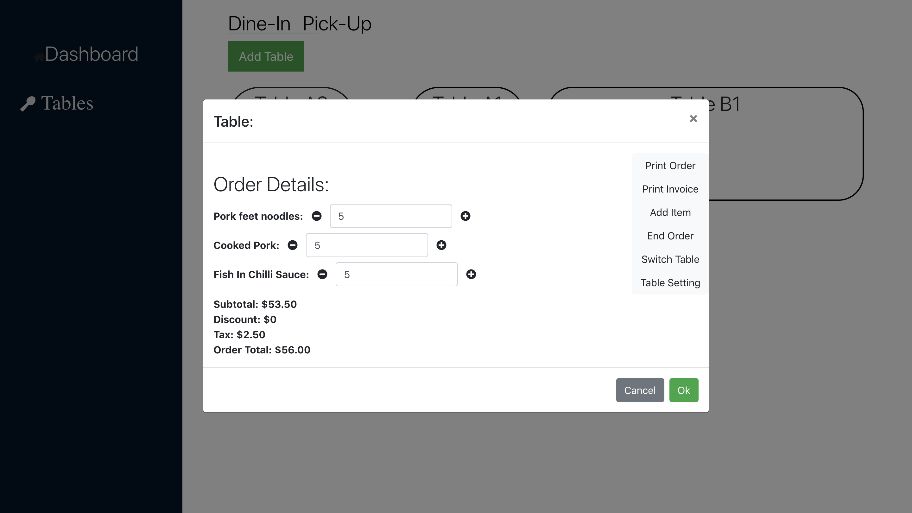

## Table Flash

Clone down this repository. You will need node and npm installed globally on your machine.

In the project directory, you can run:

### `npm install`

### `npm start`

Runs the app in the development mode. 
Open [http://localhost:3000](http://localhost:3000) to view it in the browser.

The page will reload if you make edits. 
You will also see any lint errors in the console.

## Here are the screenshots of the project

### Table tab:

### Add table modal:

### New table added in tables tab

### Table details for existing tables:

